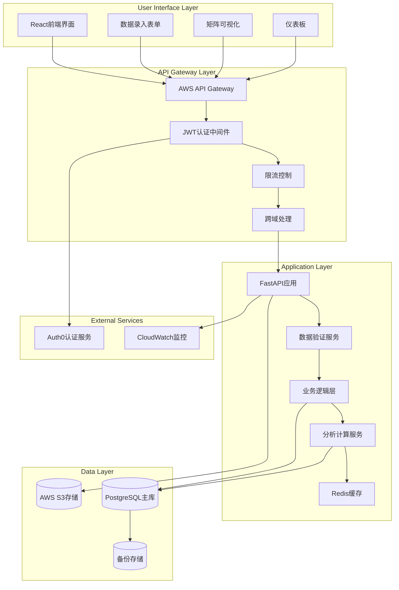

# 7. 详细数据架构和API接口设计 (Detailed Data Architecture & API Design)

## 7.1 完整数据流架构图

**数据生命周期完整流程：**



**数据流处理层次：**

```typescript
// 数据处理管道设计
interface DataProcessingPipeline {
  input: RawUserInput;
  validation: ValidationResult;
  transformation: ProcessedData;
  storage: DatabaseRecord;
  analysis: AnalyticsResult;
  output: UserFacingData;
}

// 具体数据流实现
class DataPipeline {
  async processUserInput(input: RawUserInput): Promise<ProcessedDataResult> {
    // 1. 输入验证阶段
    const validationResult = await this.validateInput(input);
    if (!validationResult.isValid) {
      throw new ValidationError(validationResult.errors);
    }
    
    // 2. 数据转换阶段
    const transformedData = await this.transformData(input, validationResult);
    
    // 3. 数据存储阶段
    const storedRecord = await this.storeData(transformedData);
    
    // 4. 触发分析更新
    await this.triggerAnalyticsUpdate(storedRecord);
    
    // 5. 返回处理结果
    return {
      record: storedRecord,
      analytics: await this.getUpdatedAnalytics(storedRecord.user_id),
      correlations: await this.getAffectedCorrelations(storedRecord)
    };
  }
}
```

## 7.2 RESTful API完整规范设计

**API版本化和统一响应格式：**

```typescript
// API版本化策略
const API_BASE_URL = "/api/v1";

// 统一响应格式接口
interface APIResponse<T> {
  success: boolean;
  data: T | null;
  error?: {
    code: string;
    message: string;
    details?: Record<string, any>;
  };
  metadata?: {
    timestamp: string;
    version: string;
    request_id: string;
  };
}

// 分页响应格式
interface PaginatedResponse<T> extends APIResponse<T[]> {
  pagination: {
    page: number;
    page_size: number;
    total_count: number;
    total_pages: number;
    has_next: boolean;
    has_previous: boolean;
  };
}
```

**核心API端点详细设计：**

```python