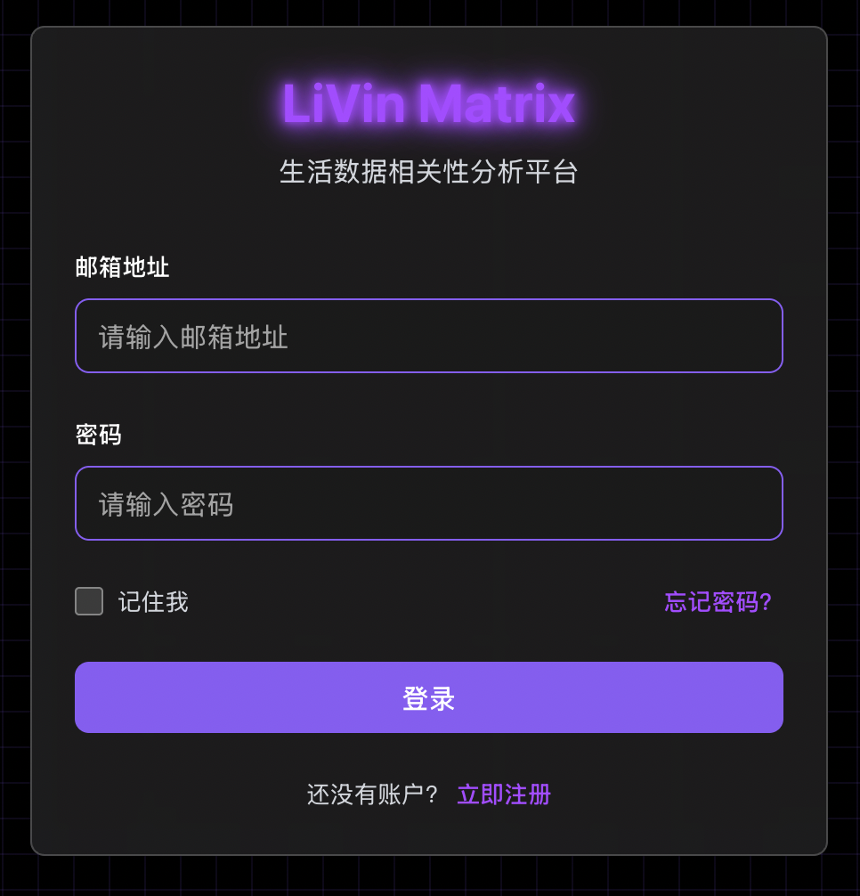
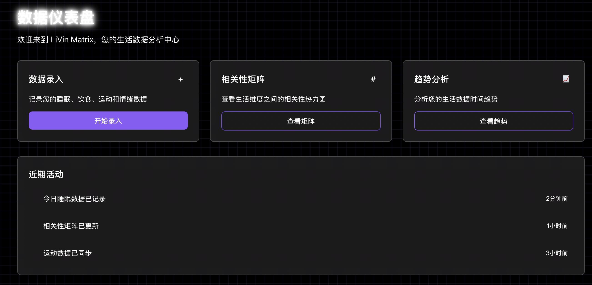
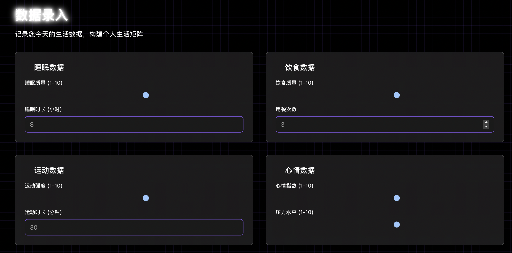

## 2025-08-12（星期二）开发日志

**ADR-005**: 创建环境配置分离架构决策记录

完成了系统性的环境配置分离架构重构，现在本地开发和生产环境共用相同的标准化部署方式，减少部署误差。

GitHub OAuth 两个独立应用分别管理本地和生产环境。

Epic 1 & 1.5 正式完成，验证了双环境部署成功，用户测试无障碍。

## 2025-08-10（星期日）开发日志

###  核心成就：文档架构重构完成
完成了项目文档的系统性重构，建立了**三层智慧架构**，实现了文档体系的现代化：

**三层架构设计**：
- **Strategy层** (`docs/strategy/`) - 产品愿景和战略决策
- **Planning层** (`docs/planning/`) - 技术实施规划和架构设计
- **Execution层** (`docs/execution/`) - 具体实施指南和操作文档

**清理成果**：
- 删除80+个过时文档文件，包括整个`docs/architecture/`、`docs/epics/`、`docs/tasks/`目录
- 移除7个冗余的README和setup guide文件
- 保留并重新组织有价值的技术内容，避免信息丢失

---

## 2025-08-06（星期三）开发日志

### 问题发现：Epic 1理想与现实的差距
深入分析项目管理流程，发现了BMAD-METHOD实施中的关键问题：

**文档演进路径复原**：
```
project brief → prd.md → architecture/ → tasks/ → frontend-spec.md →
frontend-tasks/ → epics/ → stories/ (由Scrum Master生成)
```

### 核心问题识别

**1. AI Agent幻觉问题**
- **现象**：Dev Agent将人类必须执行的任务标记为完成（如AWS账号创建、GitHub Secrets配置）
- **影响**：QA Agent审计也通过，导致系统性的完成度虚报
- **后果**：不得不创建Epic 1.5补充人类操作任务

**2. 技术债务累积危机**
- **Auth0→GitHub OAuth迁移**：因成本考虑迁移，但遗留代码清理不彻底
- **环境启动混乱**：Agent使用临时方案，产生敏感信息泄露风险
- **测试用例老化**：导致CI/CD流水线失效
- **公开仓库安全风险**：大量secrets暴露需要系统性清理

### 当前技术状态
- **标准化Scripts**：实现一键启动服务
- **安全管理**：Docker Secrets（本地）+ GitHub Secrets（CI/CD）

---

## 2025-08-05（星期二）开发日志

### 技术债务集中清理日
**三大核心问题解决**：

1. **标准化启动流程**
   - 建立统一的服务启动脚本
   - 消除Agent的非标准操作方式

2. **安全管理体系**
   - 全面迁移到Docker Secrets管理
   - 彻底移除.env文件依赖

3. **测试框架现代化**
   - 清理Auth0遗留测试用例
   - 重构测试套件，确保CI/CD稳定运行

## 2025-08-04（星期一）开发日志

### 基础设施优化决策
- 采用Docker Secrets管理敏感信息，替代.env文件方案
- 集成Resend邮箱登录服务，与GitHub OAuth形成双重认证体系
- 制定前后端服务标准化启动脚本需求：
  1. 解决进程管理不稳定和会话依赖问题
  2. 标准化启动流程，确保环境一致性
  3. 优化macOS网络配置和端口访问
  4. 建立服务故障恢复机制

### 技术债务危机与解决
- **CI/CD系统性故障**：后端测试用例老化严重，Auth0遗留代码阻塞主流水线
- **长期未提交风险**：技术债务累积，面临工作成果丢失风险
- **应对策略**：企业级安全扫描后分阶段提交 - 安全文件优先→敏感信息清理→系统验证
/
### 开发流程反思
- Agent服务启动流程需要严格标准化约束，避免不规范操作2
- 后端规范化应采用渐进式策略，避免过度工程化
- 域名配置完成后需更新Resend配置以支持无限制邮件发送

### 核心挑战
1. **安全管理复杂性**：敏感信息泄露防护需要系统性解决方案
2. **遗留代码清理**：Auth0相关代码与新GitHub OAuth系统共存导致冲突
3. **技术债务权衡**：重构成本与功能推进之间的策略选择
4. **文档同步滞后**：重大架构变更后文档更新不及时，导致开发指导偏差


## 2025-08-02（星期六）开发日志

### 本阶段目标
完成 Epic 1.5 的剩余工作内容，整合 Epic 1 + Epic 1.5 形成完整系统，并进行端到端系统测试验证。

---

### 阶段进展总结

- **AWS 配置完毕**
- **Auth0 迁移到 GitHub OAuth**：因 Auth0 每月 $35 费用考虑，迁移到免费的 GitHub OAuth
- **敏感信息管理方案实施**：建立环境变量模板系统，确保公开仓库中敏感数据安全
  - 创建 .env.template 文件替代实际 .env 文件的版本控制
  - 实现自动化环境设置脚本（setup-env.sh）
  - 完善 .gitignore 规则，增强敏感文件保护
  - 编写安全设置文档（SECURITY-SETUP.md）
- **重构 Epic 1.5 stories（1.5.2~1.5.9）**：1.5.1 已无障碍完成，但在执行 1.5.2 时因 docker 环境配置不完善而卡壳。为此进行了系统性排查，识别出多个未完成的人工操作任务，并根据任务间的依赖关系重新设计和重构了后续 stories，确保执行路径的可行性

---

### 遇到的问题与思考

- **AI 可操作任务与人工任务划分不清晰**：导致 AI 产生幻觉，强行将只有人工才能完成的工作标记为已完成。目前尝试在规划阶段明确标注或分离 AI/人工任务，但尚无特别有效的解决方案

---

### 明日计划（进入收尾阶段）
- 逐步完成 Epic 1.5 剩余工作内容

## 2025-08-01（星期五）开发日志

### 本阶段目标
使用 BMAD-METHOD 驱动开发，完成 Epic 1 的全部 6 个 Story，构建系统性可交付成果。

---

### 阶段进展总结

#### Epic 1 全部开发完成（Story 1.1–1.6）

- **Story 1.1**: 建立标准化的项目结构与开发环境（React 18 + Vite + TypeScript + Tailwind CSS）
- **Story 1.2**: 设计并部署支持六大维度（睡眠、饮食、运动、情绪、工作效率、社交）的完整数据库模型
- **Story 1.3**: 集成用户认证机制（历史：原Auth0实现，现已迁移至GitHub OAuth实现），包含JWT验证中间件
- **Story 1.4**: 开发完整 API 接口框架，含 OpenAPI/Swagger 文档与统一的错误处理规范
- **Story 1.5**: 建立 CI/CD 流水线，配置 GitHub Actions 工作流和部署脚本
- **Story 1.6**: 部署 AWS 云原生基础设施（EKS集群、RDS PostgreSQL、ALB负载均衡、VPC网络安全配置等）
- 前端 GitHub Pages 部署完成，支持自定义域名配置
- 全量执行端到端系统验收测试

#### Epic 1.5 细化任务执行（Story 1.5 的具体实施步骤）

- AWS 账号创建与基础环境配置
- 认证服务配置（历史：Auth0，现：GitHub OAuth）、用户角色权限、Token 验证流程集成
- GitHub Actions CI/CD 环境配置与部署流水线建立
- 前端构建优化与 GitHub Pages 托管部署
- DNS 解析配置与 HTTPS 证书管理
- 系统级别手动验收，确保 AI agent 构建的各组件可以闭环运作

---

### 遇到的问题与思考

- **关于用户可测试性导向的任务拆分**
  当前部分 story（特别是 Epic 2 的数据库与状态逻辑改动）缺乏配套的 UI 或测试界面，导致用户无法及时感知变更，回归测试成本增加。后续应当采用「每个 Story 至少包含一个可用户测试的组件」为准则进行划分。

- **关于 AI agent 与人工职责分工**
  BMAD-METHOD 虽然高度自动化，但目前 AI agent 并不具备外部账户管理、CI/CD、云服务接入等权限，必须在规划阶段明确哪些任务由人类开发者负责，哪些可以交给 agent 执行，避免事后堆积一批人类收尾任务。

- **关于 Story 推进节奏的组织策略**
  本轮一次性推进了多个 story，由 AI 先完成 Story 本体，再由我集中完成全部配套任务。这种节奏虽在开发期看似高效，但在集成测试与部署环节风险放大。后续建议采用 Story → 联调 → Story 的滚动推进节奏，确保每个功能闭环验证后再进入下一个。

---

### 技术架构要点总结
- **前端**: React 18 + TypeScript + Vite + Tailwind CSS 4.x，采用赛博朋克视觉主题
- **后端**: FastAPI + SQLAlchemy + Pydantic + PostgreSQL，基于异步架构
- **基础设施**: AWS EKS + RDS + ALB + VPC，采用云原生容器化部署
- **CI/CD**: GitHub Actions 双流水线（前端/后端），支持自动测试和部署

---

### 明日计划（进入收尾阶段）
- 逐步完成 Epic 1.5 剩余工作内容
- 准备进入 Epic 2 数据录入界面开发阶段

## 2025-07-30（星期三）开发日志

### 今日目标
继续使用 BMAD-METHOD 推进项目开发。

---

### 今日进展
- 完成 BMAD-METHOD 的全流程执行链条，包括：
  - `analyst` 生成 project brief
  - `project manager` 产出初版 PRD 文档
  - `ux expert` 完成界面草图与交互设计
  - `architect` 确定系统架构与技术选型
  - `project owner` 审核全链文档并完成内容分块
  - `scrum master` 输出任务拆解与故事列表
  - `dev` agent 实现 Story 1.1 核心逻辑
  - `qa` agent 对 Story 1.1 进行评审与文档化反馈

- 可视化成果（前端页面初步完成）：
  - `/login` 登录页面
  - `/dashboard` 仪表盘页面
  - `/data-entry` 数据录入界面

---

### 遇到的问题与思考
- BMAD-METHOD 在多 agent 协同使用过程中对 Claude Code token 的消耗量非常大，未来可能需要引入上下文压缩与缓存机制进行优化
- 尽管项目尚未完全运行，仅通过观察各 agent 在问题拆解、结构建模与任务对齐方面的处理方式，已经获得了大量关于系统化开发的思考。BMAD-METHOD 不仅是一套开发执行框架，也是一种值得学习的方法论体系

---

### 视觉参考

#### 页面截图：主要 UI 原型（前端已可交互）





当前为功能性原型阶段，尚存在以下限制：
- 表单尚未联通后端 API，数据不可持久化
- 缺乏服务层与状态逻辑支撑，仍为纯展示态
- 后端服务尚未接入业务流转与验证模块

---

### 明日计划
将配合 `ux expert` 进行 UI 层的优化调整，重点包括以下两点：

- 当前 `/data-entry` 与 `/dashboard` 页面仍使用白色泛光字体，视觉对比度不足，影响整体可读性。拟借鉴 `/login` 页面已验证的紫色主题色风格，并进一步削弱 glow 效果以增强层次感和文本清晰度。

- `/data-entry` 页面中的 slider 组件存在明显的视觉结构缺失。当前仅渲染了滑块圆点（thumb），但缺少清晰的滑动轨道（track）作为背景支撑，导致控件在视觉上呈悬空状态，缺乏交互暗示，容易被误判为静态图元。后续将补充 bar 元素并调整整体样式，以恢复组件的结构感与可交互性指示。

## 2025-07-29 星期二

### 今日目标
使用 BMAD-METHOD 正式启动新项目立项流程

---

### 今日任务
- 成功完成 BMAD-METHOD 的本地部署与环境配置
- 与 `analyst` agent 协作撰写了项目 `project brief`
- 随后与 `project manager` agent 共同完成了初版 PRD 文档

---

### 遇到的问题与学到的思考
- 与 AI 协同开发时，必须保持高度专注与主动性。一旦偷懒放任 AI 自行决策，容易酿成严重偏离预期的结果：
  - 其一：当前 AI 的架构能力仍有限，常为完成任务而作出短视决策，牺牲全局性与可维护性
  - 其二：若人类中途跟不上AI的节奏就容易陷入惯性依赖——看不懂就不管，最终让系统朝未知方向发展
- 高效协作的前提是：AI 可以操作，但控制必须在人手中。每一个决策都必须由人来理解、判断与把关
- 当前的 AI 已经是优秀的"码字员"与"虚拟团队成员"，但真正具备长期价值的角色，是有抽象力与统筹力的 Architect 与 Project Manager
- 未来程序执行工作将大规模被替代，人类需要向系统思维、战略设计与判断能力迁移，才能不被边缘化

---

### 明日计划
在集中精力的前提下进行Epic 1的开发工作
