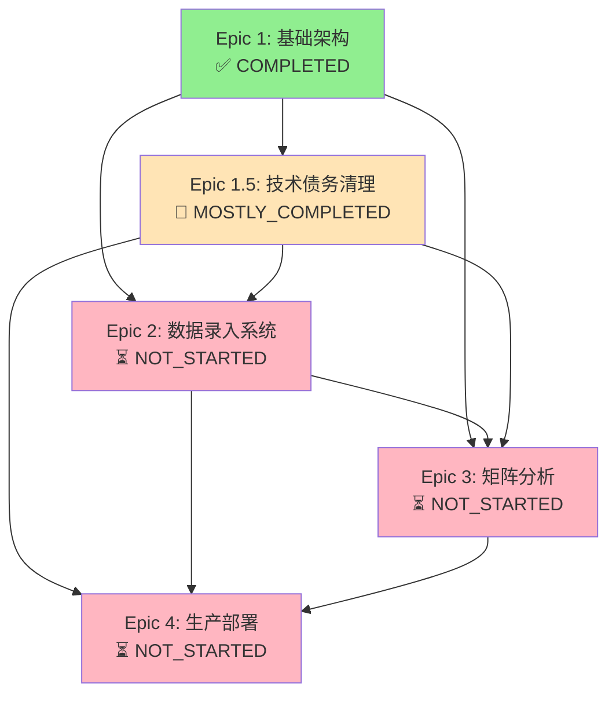

# LiVin Matrix 产品路线图与Epic创建指南

**本文档是Scrum Master创建Epic Stories的核心指南，整合了完整的依赖关系架构分析。它定义了每个Epic的具体目标、实现步骤、验收标准和关键依赖关系，为所有执行层开发工作提供权威参考。**

**🎯 依赖关系优先级声明**: 基于项目历史教训，依赖关系被视为规划的最高优先级要素。所有Epic和Story的执行必须严格遵循依赖关系约束。

**最后更新**: 2025-08-10 | **依赖关系架构师**: Winston

## 核心产品原则

### 技术约束
- **成本控制**: 月运营成本 < $10 (AWS免费层+GitHub+Resend)
- **技术栈**: React 18+/TypeScript + FastAPI/PostgreSQL + Docker + AWS
- **质量标准**: 80%测试覆盖率，完整CI/CD，类型安全
- **部署方式**: K3s轻量级容器编排，GitHub Pages前端

### 产品定位
- **核心价值**: 6维度生活数据相关性分析矩阵
- **用户体验**: 3-4分钟高效数据录入，直观矩阵交互
- **数据主权**: 完整导出能力(CSV/JSON)，用户数据完全自主

---

## 📊 Epic执行状态与依赖关系概览

### 当前完成状态快照

```yaml
epic_completion_status:
  epic_1: "COMPLETED ✅" # 基础技术架构已完成
  epic_1_5: "MOSTLY_COMPLETED 🔄" # 技术债务清理，还有3个stories待完成
  epic_2: "NOT_STARTED ⏳" # 数据录入系统
  epic_3: "NOT_STARTED ⏳" # 矩阵相关性分析
  epic_4: "NOT_STARTED ⏳" # 生产环境部署
```

### 🚨 历史风险教训总结
基于项目实际经历的依赖关系失效事件：

1. **Epic 1完成后发现人类操作任务未执行** → 创建Epic 1.5
   - **教训**: Epic定义阶段未充分识别人工操作依赖
   - **影响**: Epic级别的重新规划和项目延期

2. **Auth0→GitHub OAuth迁移引发连锁重构**
   - **教训**: 第三方服务变更的影响评估不足
   - **影响**: 认证相关的所有组件需重新开发

3. **测试框架老化在CI/CD集成时才发现**
   - **教训**: 基础设施依赖的渐进性老化未被及时发现
   - **影响**: 整个CI/CD流水线阻塞，开发流程中断

### Epic间依赖关系流程图



### 关键路径分析

**关键路径**: Epic 1 → Epic 1.5 → Epic 2 → Epic 3 → Epic 4
- **总预计时间**: 20-24周
- **当前进度**: 约70% (Epic 1完成 + Epic 1.5大部分完成)
- **关键瓶颈**: Epic 1.5的AWS基础设施部署 (Stories 1.5.7-1.5.9)

**并行开发机会**: Epic 2和Epic 3可以部分并行，预计可节省4-6周

---

## Epic 1: 核心技术基础架构 ✅ COMPLETED

### Epic 1 总体目标
建立完整的技术基础设施，包括数据库、认证系统、部署流程，为产品核心功能提供稳固技术支撑。

### Epic 1 依赖关系状态
```yaml
dependencies: [] # 基础Epic，无前置依赖
outputs:
  - react_typescript_frontend: "✅ 已完成"
  - fastapi_backend_framework: "✅ 已完成"
  - postgresql_database_schema: "✅ 已完成"
  - github_oauth_authentication: "✅ 已完成 (迁移到1.5.4)"
  - docker_containerization: "✅ 已完成"
critical_downstream_dependencies:
  - epic_2: "HARD_DEP - 需要认证系统和数据库"
  - epic_3: "TECH_DEP - 需要数据库架构"
  - epic_4: "INFRA_DEP - 需要容器化基础"
```

### Epic 1 实现路径

#### Story 1.1: 项目基础架构搭建 ✅ DONE
**验收标准**:
- [x] 前后端项目结构完整
- [x] Docker容器化配置就绪
- [x] 本地开发环境可一键启动
- [x] 基础CI/CD流程运行正常

**技术要点**:
- React 18 + Vite + TypeScript前端框架
- FastAPI + SQLAlchemy + PostgreSQL后端架构
- Docker Compose开发环境配置
- GitHub Actions基础CI/CD管道

#### Story 1.2: 数据库设计与部署 ✅ DONE
**验收标准**:
- [x] 用户表、数据记录表、相关性分析表设计完成
- [x] Alembic数据库迁移机制配置
- [x] PostgreSQL生产环境部署方案确认
- [x] 数据库备份恢复流程验证

**技术要点**:
- 6维度数据模型设计(睡眠/饮食/运动/情绪/工作/社交)
- 用户数据隔离和权限控制
- 时间序列数据存储优化
- 数据完整性约束和索引策略

#### Story 1.3: GitHub OAuth认证集成 ✅ DONE (迁移到1.5.4)
**验收标准**:
- [x] GitHub OAuth登录流程完整
- [x] JWT token生成和验证机制
- [x] 用户会话管理和安全退出
- [x] 前后端认证状态同步

**技术要点**:
- GitHub OAuth 2.0集成
- FastAPI JWT中间件
- React认证状态管理(Context/Hooks)
- 安全token刷新机制

### Epic 1 交付成果
- ✅ 可运行的前后端应用框架
- ✅ 完整的用户认证和数据存储能力
- ✅ 自动化部署和测试流程
- ✅ 开发环境标准化配置

---

## Epic 1.5: 技术债务清理和架构优化 🔄 MOSTLY_COMPLETED

### Epic 1.5 背景说明
**创建原因**: Epic 1完成后发现人类操作任务未执行，被迫创建此Epic进行技术债务清理。

**核心教训**: 证明了依赖关系规划的关键性 - 遗漏人工操作依赖导致Epic级别的重新规划。

### Epic 1.5 依赖关系状态
```yaml
dependencies:
  - source: "Epic 1"
    type: "HARD_DEP"
    reason: "技术债务清理Epic，修复Epic 1遗留问题"

outputs:
  - aws_environment_setup: "✅ 已完成"
  - docker_secrets_management: "✅ 已完成"
  - standardized_service_startup: "✅ 已完成"
  - github_oauth_production_ready: "✅ 已完成"
  - api_framework_validated: "✅ 已完成"
  - cicd_pipeline_verified: "✅ 已完成"
  - aws_infrastructure_deployment: "🔄 进行中 - Story 1.5.7"
  - frontend_deployment_config: "⏳ 待开始 - Story 1.5.8"
  - end_to_end_testing: "⏳ 待开始 - Story 1.5.9"

risk_mitigation_achievements:
  - "✅ 解决了Epic 1中遗漏的人工操作任务"
  - "✅ 完成了Auth0→GitHub OAuth的架构转换"
  - "✅ 现代化了测试框架，有98个现代化测试用例"
  - "🔄 正在完成AWS基础设施部署"

blocking_impact:
  - "Epic 2无法开始：需要生产就绪的基础设施"
  - "Epic 3无法开始：需要稳定的计算环境"
  - "Epic 4无法开始：需要完整的AWS基础设施"
```

### Epic 1.5 完成状态详情

#### 已完成Stories ✅
- **1.5.1**: AWS环境setup
- **1.5.2**: Docker环境setup
- **1.5.3**: PostgreSQL数据库setup
- **1.5.4**: GitHub OAuth认证系统
- **1.5.5**: API框架验证
- **1.5.6**: CI/CD配置验证

#### 待完成Stories 🔄
- **1.5.7**: AWS基础设施部署 (Ready - 关键瓶颈)
- **1.5.8**: 前端部署配置 (Ready)
- **1.5.9**: 端到端系统测试 (Ready)

### 🚨 关键风险警告
**Epic 1.5未完成将阻塞所有后续Epic**:
- **风险等级**: P0 - CRITICAL
- **预计完成时间**: 1.5-2周
- **建议行动**: 立即完成Stories 1.5.7-1.5.9

---

## Epic 2: 数据录入与管理系统 ⏳ NOT_STARTED

### Epic 2 总体目标
构建高效、用户友好的6维度数据录入系统，支持历史数据管理和批量操作，确保3-4分钟完成日常数据录入。

### Epic 2 依赖关系分析
```yaml
dependencies:
  - source: "Epic 1"
    type: "TECH_DEP"
    details: "需要认证系统支持用户数据录入"
    critical_outputs: ["github_oauth_authentication", "postgresql_database_schema"]
    completion_status: "✅ 已满足"

  - source: "Epic 1.5"
    type: "HARD_DEP"
    details: "需要生产就绪的基础设施"
    critical_outputs: ["aws_infrastructure_deployment", "production_ready_authentication"]
    completion_status: "🔄 部分满足 - 等待1.5.7-1.5.9完成"
    risk_factor: "HIGH"
    risk_reason: "如果1.5未完成，数据录入功能无法安全部署"

blocking_factors:
  - "Epic 1.5.7 (AWS基础设施部署) 未完成"
  - "Epic 1.5.8 (前端部署配置) 未完成"

estimated_start_date: "Epic 1.5完成后1周内"
estimated_timeline: "6-8周 (并行开发可节省2-3周)"

downstream_impact:
  - "Epic 3需要30天连续数据积累"
  - "Epic 4需要验证数据录入功能"
```

### Epic 2 并行开发策略
```yaml
parallel_opportunities:
  phase_1_parallel:
    - "2.1_data_entry_ui"
    - "2.3_basic_visualization" (使用模拟数据)
    coordination: "需要统一数据格式约定"

  phase_2_sequential:
    - "2.2_historical_data_mgmt" (必须等2.1完成)
```

### Epic 2 实现路径

#### Story 2.1: 6维度数据录入界面
**验收标准**:
- [ ] 6维度评分界面(1-10分制)
- [ ] 智能默认值和历史数据预填充
- [ ] 完整键盘导航支持
- [ ] 3-4分钟录入时间目标达成

**技术要点**:
- React Hook Form数据验证
- 响应式UI组件设计
- 本地数据缓存和自动保存
- 键盘快捷键交互优化

#### Story 2.2: 历史数据管理
**验收标准**:
- [ ] 历史记录查看和编辑功能
- [ ] 数据筛选和排序能力
- [ ] 批量数据导入导出(CSV/JSON)
- [ ] 数据删除和恢复机制

**技术要点**:
- 数据表格组件(虚拟滚动优化)
- 日期范围选择器
- 文件上传下载处理
- 数据格式验证和转换

#### Story 2.3: 数据可视化基础
**验收标准**:
- [ ] 单维度趋势图表展示
- [ ] 数据统计摘要(均值/标准差)
- [ ] 时间段对比分析
- [ ] 图表导出和分享功能

**技术要点**:
- Chart.js或D3.js图表库集成
- 数据聚合和统计计算
- 响应式图表设计
- 图表配置和主题定制

### Epic 2 交付成果
- 完整的6维度数据录入工作流
- 历史数据管理和导出能力
- 基础数据可视化展示
- 高效的用户交互体验

---

## Epic 3: 矩阵相关性分析核心 ⏳ NOT_STARTED

### Epic 3 总体目标
实现LiVin Matrix的核心价值功能：6x6维度相关性分析矩阵，提供统计学意义的数据洞察和交互式探索体验。

### Epic 3 依赖关系分析
```yaml
dependencies:
  - source: "Epic 1"
    type: "TECH_DEP"
    details: "需要数据库架构支持相关性计算"
    critical_outputs: ["postgresql_database_schema"]
    completion_status: "✅ 已满足"

  - source: "Epic 2"
    type: "DATA_DEP"
    details: "需要足够的历史数据进行相关性分析"
    minimum_data_threshold: "30天连续数据录入，至少5个活跃用户"
    risk_factor: "CRITICAL"
    risk_reason: "无足够数据时相关性分析无统计学意义"
    completion_status: "⏳ 依赖Epic 2完成后的数据积累"

  - source: "Epic 1.5"
    type: "INFRA_DEP"
    details: "需要稳定的生产环境支持计算密集型操作"
    critical_outputs: ["aws_environment_setup", "cicd_pipeline_verification"]
    completion_status: "🔄 部分满足 - 等待1.5.7-1.5.9完成"

blocking_factors:
  - "Epic 1.5未完成 - 缺乏稳定计算环境"
  - "Epic 2未开始 - 无法开始数据积累"
  - "数据量阈值风险 - 需要至少30天连续数据"

estimated_start_date: "Epic 2开始后可并行进行算法开发"
estimated_timeline: "8-10周"

critical_risks:
  data_insufficiency_risk:
    level: "CRITICAL"
    scenario: "用户数据录入不足，相关性分析无统计意义"
    mitigation: "建立数据生成工具，用户激励机制，bootstrapping方法"

  algorithm_performance_risk:
    level: "HIGH"
    scenario: "相关性计算性能不达标(>5秒响应)"
    mitigation: "使用成熟统计库，实施缓存机制，分布式计算"
```

### Epic 3 并行开发策略
```yaml
parallel_development_approach:
  algorithm_development:
    story: "3.1_correlation_engine"
    approach: "使用模拟数据进行算法开发和测试"
    timeline: "可与Epic 2并行进行"

  frontend_visualization:
    stories: ["3.2_matrix_visualization", "3.3_data_drilling"]
    approach: "使用Mock API数据进行界面开发"
    timeline: "可与3.1并行开发"

  integration_phase:
    prerequisite: "Epic 2完成 + 30天数据积累"
    timeline: "Epic 2完成后4-6周"
```

### Epic 3 实现路径

#### Story 3.1: 相关性计算引擎
**验收标准**:
- [ ] 皮尔逊相关系数计算算法
- [ ] 统计显著性检验(p值计算)
- [ ] 时间窗口和样本量配置
- [ ] 异常数据处理和过滤机制

**技术要点**:
- NumPy/SciPy等价JavaScript库
- 后端统计计算API设计
- 数据质量评估算法
- 缓存机制优化计算性能

#### Story 3.2: 6x6矩阵可视化
**验收标准**:
- [ ] 热力图矩阵界面展示
- [ ] 颜色编码相关性强度
- [ ] 交互式矩阵单元格点击
- [ ] 相关性数值和显著性标识

**技术要点**:
- 自定义矩阵组件开发
- 颜色渐变算法(相关性强度映射)
- SVG或Canvas绘制优化
- 触控设备交互适配

#### Story 3.3: 数据钻取和详情分析
**验收标准**:
- [ ] 点击矩阵单元格查看详细数据
- [ ] 双变量散点图和趋势线
- [ ] 时间序列对比分析
- [ ] 相关性强度变化历史

**技术要点**:
- 模态框或侧边栏详情展示
- 多维度数据可视化
- 数据过滤和时间范围选择
- 图表联动和数据同步

### Epic 3 交付成果
- 功能完整的6x6相关性分析矩阵
- 统计学严谨的数据分析能力
- 直观易用的矩阵交互界面
- 深入的数据探索和洞察工具

---

## Epic 4: 生产环境部署与运维 ⏳ NOT_STARTED

### Epic 4 总体目标
建立完整的生产环境部署流程，实现低成本(<$10/月)、高可用、自动化运维的云端服务。

### Epic 4 依赖关系分析
```yaml
dependencies:
  - source: "Epic 1.5"
    type: "HARD_DEP"
    details: "需要完整的AWS基础设施"
    critical_outputs: ["aws_infrastructure_deployment", "cicd_pipeline_verification"]
    completion_status: "🔄 等待1.5.7-1.5.9完成"
    risk_factor: "CRITICAL"
    risk_reason: "生产部署Epic，完全依赖基础设施完备性"

  - source: "Epic 3"
    type: "SOFT_DEP"
    details: "核心功能完整性影响生产就绪度"
    critical_outputs: ["correlation_calculation_engine", "matrix_visualization"]
    completion_status: "⏳ 未开始"

  - source: "Epic 2"
    type: "TECH_DEP"
    details: "需要数据录入功能在生产环境验证"
    critical_outputs: ["data_entry_ui", "data_validation_framework"]
    completion_status: "⏳ 未开始"

blocking_factors:
  - "Epic 1.5基础设施未完成 - 无法开始生产部署"
  - "需要Epic 2+3的核心功能验证生产就绪度"

estimated_start_date: "Epic 3核心功能完成后"
estimated_timeline: "4-6周"

cost_risks:
  aws_cost_overrun:
    level: "MEDIUM"
    budget_target: "<$10/month"
    risk_factors: ["EKS集群运行成本", "RDS数据库存储增长", "免费层配额用尽"]
    mitigation: ["详细成本监控告警", "自动化资源清理", "资源使用效率优化"]
```

### Epic 4 实现路径

#### Story 4.1: AWS基础设施配置
**验收标准**:
- [ ] AWS免费层资源配置(EC2/RDS/S3)
- [ ] K3s容器集群部署
- [ ] 网络安全组和访问控制
- [ ] SSL证书和域名配置

**技术要点**:
- Terraform基础设施即代码
- K3s轻量级Kubernetes部署
- AWS免费层资源限制管理
- Let's Encrypt自动SSL证书

#### Story 4.2: CI/CD生产部署流程
**验收标准**:
- [ ] 主分支自动部署到生产环境
- [ ] 蓝绿部署或滚动更新策略
- [ ] 部署失败自动回滚机制
- [ ] 部署状态通知和监控

**技术要点**:
- GitHub Actions生产环境集成
- Docker镜像构建和注册表
- Kubernetes deployment配置
- 部署健康检查和监控

#### Story 4.3: 监控和运维系统
**验收标准**:
- [ ] 应用性能监控(APM)
- [ ] 日志聚合和错误追踪
- [ ] 资源使用率监控和告警
- [ ] 数据备份和灾难恢复

**技术要点**:
- 轻量级监控解决方案(如Prometheus)
- 日志管理(ELK stack或类似)
- 自动化备份脚本
- 成本监控和优化

### Epic 4 交付成果
- 稳定运行的生产环境
- 完全自动化的部署流程
- 全面的监控和运维能力
- 低成本高效的运营模式

---

## Epic创建指导原则

### Story拆分标准
1. **用户价值驱动**: 每个Story必须为最终用户提供可见价值
2. **技术可行性**: Story规模适合单个开发周期(1-2周)
3. **独立性**: Story之间依赖关系最小，可独立开发测试
4. **验收标准明确**: 具备可测试的验收条件和成功指标

### 技术决策要求
1. **架构一致性**: 遵循planning/目录下的架构决策
2. **成本意识**: 所有技术选择必须考虑运营成本影响
3. **质量标准**: 代码质量、测试覆盖率、性能标准不可妥协
4. **学习价值**: 技术选择应具备教育和作品集展示价值

### 优先级判断框架
**P0 (必须有)**: 直接影响核心6维度矩阵分析功能
**P1 (应该有)**: 显著提升用户体验或系统稳定性
**P2 (可以有)**: 锦上添花功能，不增加系统复杂度
**P3 (不需要)**: 功能蔓延，偏离产品核心价值

---

## 🔧 依赖关系管理工具与指南

### AI Agent依赖关系管理检查清单

```yaml
dependency_management_checklist:
  epic_creation:
    - [ ] 识别所有前置Epic依赖
    - [ ] 评估依赖失效风险等级
    - [ ] 准备备选方案和缓解措施
    - [ ] 建立监控机制和预警指标

  story_creation:
    - [ ] 验证前置Story完成状态
    - [ ] 确认API接口契约定义
    - [ ] 验证数据模型兼容性
    - [ ] 评估并行开发可行性

  epic_execution:
    - [ ] 每日依赖健康度检查
    - [ ] 每周风险评估更新
    - [ ] 每月依赖关系回顾
    - [ ] 关键里程碑依赖验证

  completion_verification:
    - [ ] 所有验收标准通过
    - [ ] 下游依赖需求满足
    - [ ] 风险缓解措施就位
    - [ ] 依赖关系文档更新
```

### 自动化依赖健康检查

```bash
#!/bin/bash
# dependency_health_check.sh - 每日依赖关系健康度检查

echo "=== LiVin Matrix 依赖关系健康检查 ==="
echo "执行时间: $(date)"

# 检查Epic 1.5完成度
echo "检查Epic 1.5完成状态..."
if [ -f "docs/stories/epic1.5/1.5.7.aws-infrastructure-deployment.md" ]; then
    status_157=$(grep -o 'Status.*' docs/stories/epic1.5/1.5.7.aws-infrastructure-deployment.md)
    echo "Story 1.5.7状态: $status_157"
fi

# 检查数据积累状况
echo "检查数据积累状况..."
if command -v psql &> /dev/null; then
    data_count=$(psql -h localhost -U postgres -d livin_matrix_dev -t -c "SELECT COUNT(*) FROM user_daily_records;" 2>/dev/null)
    echo "当前数据记录数量: $data_count"
    if [ $data_count -lt 150 ]; then  # 5用户 * 30天
        echo "⚠️  数据量不足，Epic 3相关性分析风险"
    fi
fi

# 检查AWS成本状况
echo "检查AWS成本状况..."
if command -v aws &> /dev/null; then
    echo "AWS账号状态检查..."
    aws sts get-caller-identity > /dev/null 2>&1
    if [ $? -eq 0 ]; then
        echo "✅ AWS认证正常"
    else
        echo "❌ AWS认证失败"
    fi
fi

# 检查GitHub API限制
echo "检查GitHub API限制..."
if [ ! -z "$GITHUB_TOKEN" ]; then
    rate_limit=$(curl -s -H "Authorization: token $GITHUB_TOKEN" https://api.github.com/rate_limit | jq -r '.rate.remaining' 2>/dev/null)
    if [ ! -z "$rate_limit" ]; then
        echo "GitHub API剩余调用: $rate_limit"
        if [ $rate_limit -lt 100 ]; then
            echo "⚠️  GitHub API限制接近"
        fi
    fi
fi

echo "=== 依赖检查完成 ==="
```

### 🚨 当前高风险依赖关系

```yaml
critical_risks_monitoring:
  epic_1_5_incomplete:
    risk_id: "EPIC-1.5-INCOMPLETE"
    risk_level: "CRITICAL"
    impact: "阻塞所有后续Epic开发"
    current_status: "Stories 1.5.7-1.5.9待完成"
    mitigation: "立即完成AWS基础设施部署"
    monitoring: "每日进度检查"

  data_accumulation_bottleneck:
    risk_id: "DATA-ACCUMULATION"
    risk_level: "HIGH"
    impact: "Epic 3相关性分析无法实现统计意义"
    mitigation: "数据模拟工具、用户激励、降低数据量要求"3
    monitoring: "每周数据量和质量评估"

  aws_cost_overrun:
    risk_id: "AWS-COST"
    risk_level: "MEDIUM"
    impact: "运营成本超预算影响可持续性"
    mitigation: "详细成本监控和自动告警"
    monitoring: "每日AWS费用检查"
```

### Epic创建指导原则 (整合依赖关系考量)

#### Story拆分标准
1. **用户价值驱动**: 每个Story必须为最终用户提供可见价值
2. **技术可行性**: Story规模适合单个开发周期(1-2周)
3. **依赖关系独立性**: Story之间依赖关系最小，可独立开发测试
4. **验收标准明确**: 具备可测试的验收条件和成功指标
5. **依赖关系清晰**: 所有前置依赖明确标识和验证

#### 技术决策要求
1. **架构一致性**: 遵循既定的技术架构决策
2. **成本意识**: 所有技术选择必须考虑运营成本影响
3. **质量标准**: 代码质量、测试覆盖率、性能标准不可妥协
4. **依赖关系影响**: 评估技术决策对依赖关系的影响
5. **学习价值**: 技术选择应具备教育和作品集展示价值

#### 优先级判断框架
**P0 (必须有)**: 直接影响关键路径或解决高风险依赖
**P1 (应该有)**: 显著提升系统稳定性或解决中风险依赖
**P2 (可以有)**: 功能增强但不影响依赖关系
**P3 (不需要)**: 功能蔓延，增加不必要的依赖复杂度

---

## 🎯 下一步行动计划

### 立即行动项 (本周)
1. **🔥 P0 - 完成Epic 1.5剩余Stories**
   - 1.5.7: AWS基础设施部署
   - 1.5.8: 前端部署配置
   - 1.5.9: 端到端系统测试

2. **📊 建立依赖监控**
   - 部署依赖健康检查脚本
   - 配置AWS成本监控告警
   - 建立每日风险评估流程

### 中期计划 (2-4周)
1. **🚀 启动Epic 2开发**
   - 在Epic 1.5完成后1周内开始
   - 优先开发Story 2.1和2.3并行推进
   - 建立用户数据积累激励机制

2. **🧮 准备Epic 3算法开发**
   - 使用模拟数据开始算法开发
   - 评估和集成统计库
   - 建立性能基准测试

### 长期规划 (1-3个月)
1. **📈 Epic 3核心功能交付**
   - 确保有足够数据进行统计分析
   - 完成6x6矩阵可视化
   - 实现数据钻取功能

2. **🌐 Epic 4生产部署**
   - 完整AWS基础设施配置
   - 建立监控和运维体系
   - 实现低成本高可用部署

---

## 参考文档链接

### 核心架构文档
- **技术架构详情**: `docs/planning/application-architecture.md`
- **部署策略指南**: `docs/planning/deployment-architecture.md`
- **API设计规范**: `docs/planning/integration-architecture.md`
- **安全实施要求**: `docs/planning/security-architecture.md`
- **基础设施规划**: `docs/planning/infrastructure-architecture.md`

### 依赖关系管理工具
- **依赖健康检查脚本**: `scripts/dependency_health_check.sh`
- **Epic状态跟踪**: 集成在本文档的依赖关系分析中
- **风险监控面板**: 集成在本文档的风险管理部分

---

**重要提醒**: 本路线图已整合完整的依赖关系架构分析。所有Epic和Story的开发必须严格遵循依赖关系约束，定期进行风险评估，确保项目按计划推进而不重蹈历史覆辙。

**最后更新**: 2025-08-10 by Winston (Architect) | **依赖关系分析完成**
